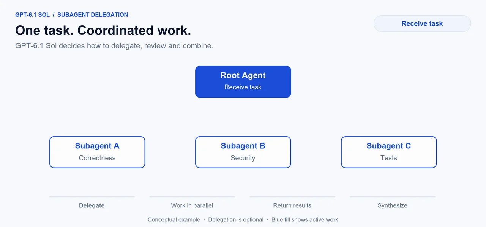
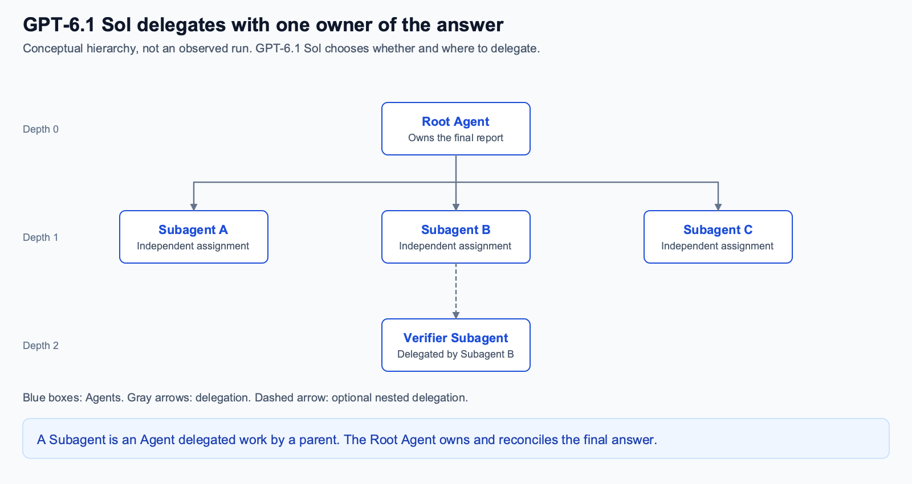

# Subagent Delegation with GPT-6.1 Sol

Code companion for **Beyond a Single Agent: Subagent Delegation with GPT-6.1 Sol**. The demo compares the same model working as a single agent and with subagents available through the Responses API’s beta **Multi-agent** capability. It uses direct JSON protocol messages over a generic WebSocket connection, without an OpenAI or Agents SDK.

The model decides whether to delegate, what to assign, and how many subagents and delegation levels to use within resource ceilings. There is no prescribed team, minimum count or required depth. The source uses `single` and `native` as internal arm identifiers; `native` means **Subagents enabled** through the API’s hosted collaboration actions.

This repository contains the implementation, twelve demo tasks, original scoring, separate post-hoc citation calibration and offline tests. Executing the study generates fresh local results. Saved results and figures from the article are not bundled.

## Delegation previews

These conceptual illustrations show optional delegation, rather than an observed study run or a prescribed team.





## Setup

Use Python 3.12 or later. From the repository root:

```sh
python3 -m venv .venv
source .venv/bin/activate
python -m pip install -e .
```

On Windows, activate the environment with `.venv\Scripts\Activate.ps1` in PowerShell.

## Run the offline checks

```sh
python experiments/responses-websocket-suite-12/test_suite.py
python experiments/responses-websocket-suite-12/test_citation_calibration.py
```

The checks replay the references, grade correct and deliberately incorrect reports, enforce source isolation, and test root-report retention and function-result delivery. They make no API calls and require no API key.

## Run the paired evaluation

The twelve tasks cover operations, procurement and planning, each with compact, independent, large and uncertain profiles. Five paired repetitions per task produce 120 assessments.

Copy `.env.example` to `.env` and add your own `OPENAI_API_KEY`. Paid execution requires access to GPT-6.1 Sol and the Multi-agent beta. Credentials and generated results are ignored by Git.

```sh
cp .env.example .env
# Edit .env to add your API key.
python experiments/responses-websocket-suite-12/study.py --freeze
python experiments/responses-websocket-suite-12/study.py --run
python experiments/responses-websocket-suite-12/analysis/analyze.py
python experiments/responses-websocket-suite-12/citation_calibration.py
```

`--freeze` records the task, scoring, runtime and initial-request hashes without calling the API. `--run` makes paid API calls. It runs the full five-pair schedule, preserves terminal attempts, and stops on unresolved admissions. No automatic model retries, reconnects or replacement trials occur. Each arm gets the same task, source access, model, reasoning effort and output contract; the enabled arm adds the discretionary delegation instruction and uses immediate tool-result injection.

The API limits active subagents to three across the tree, excluding the root. Three levels below the root and twelve total agents are instruction ceilings backed by client observation stops, not API creation limits. Other client bounds are 600 seconds and twelve responses per assessment, a USD 0.90 returned-token observation stop, and a USD 25 suite admission allowance. These are observation limits, not provider invoice caps.

## Read the generated results

After a run, `experiments/responses-websocket-suite-12/results/study/` contains report records, event journals and grades. The `analysis/` directory contains `RESULTS.md`, `comparison.json` and `runs.csv`.

Quality includes exact facts, finding precision/recall/F1, structural source coverage, unknown-value preservation, critical decisions and strict task success. Completion, completed-report timing, and paired ratios retain their separate denominators. Overall summaries weight each of the twelve tasks equally. Cost uses each unique returned response’s usage once and is expressed as estimated USD per 1,000 known-cost assessments. It is not a verified invoice total or a cost per function call.

Task answer keys are distributed for local grading, but the API-facing `read_evidence` tool can only read the indexed source files. It cannot access answer keys, arbitrary paths or this repository’s `.env` file.

The article reports the current scores in `analysis/citation-calibration/comparison.json`, including task passes and recomputed exploratory screening. The original grader and comparison retain their frozen source-ID checklist for audit. `citation_calibration.py` applies claim-specific source dependencies and verified prerequisite facts within the same report, writes only to `analysis/citation-calibration/`, and verifies the original files’ hashes. It never starts API work. These rules were calibrated on the article’s retained reports, not a held-out validation set; they are not a semantic-entailment judge.

## Source map

All implementation code is under [experiments/responses-websocket-suite-12](experiments/responses-websocket-suite-12).

| File | Purpose |
| --- | --- |
| [ws_runner.py](experiments/responses-websocket-suite-12/ws_runner.py) | WebSocket events, immediate injection, ordinary continuations and root-report collection |
| [protocol.py](experiments/responses-websocket-suite-12/protocol.py) | Shared request settings, prompts, evidence tool and token pricing |
| [report.py](experiments/responses-websocket-suite-12/report.py) | Local report validation |
| [study.py](experiments/responses-websocket-suite-12/study.py) | Freeze and execute the paired schedule |
| [grade.py](experiments/responses-websocket-suite-12/grade.py) | Deterministic report scoring |
| [reference.py](experiments/responses-websocket-suite-12/reference.py) | Calculate reference answers from sources |
| [build_cases.py](experiments/responses-websocket-suite-12/build_cases.py) | Generate the twelve demo tasks |
| [citation_calibration.py](experiments/responses-websocket-suite-12/citation_calibration.py) | Separate offline post-hoc source-dependency analysis and preservation checks |
| [test_citation_calibration.py](experiments/responses-websocket-suite-12/test_citation_calibration.py) | Eleven offline checks for necessary sources, wrong values and broken dependency chains |
| [test_suite.py](experiments/responses-websocket-suite-12/test_suite.py) | Offline reference, scoring, source-isolation and collector checks |
| [analysis/analyze.py](experiments/responses-websocket-suite-12/analysis/analyze.py) | Summarize results generated by your run |
| [cases/](experiments/responses-websocket-suite-12/cases) | Task inputs, source allowlists and offline answer keys |

See [DESIGN.md](experiments/responses-websocket-suite-12/DESIGN.md) for the evaluation controls.

## Documentation

- [Multi-agent guide](https://developers.openai.com/api/docs/guides/responses-multi-agent)
- [Responses API WebSocket mode](https://developers.openai.com/api/docs/guides/websocket-mode)
- [GPT-6.1 Sol model and pricing](https://developers.openai.com/api/docs/models/gpt-6.1-sol)
